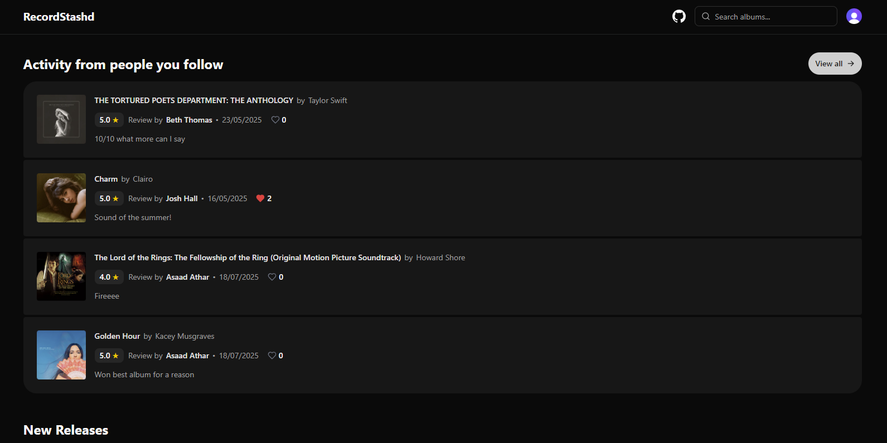
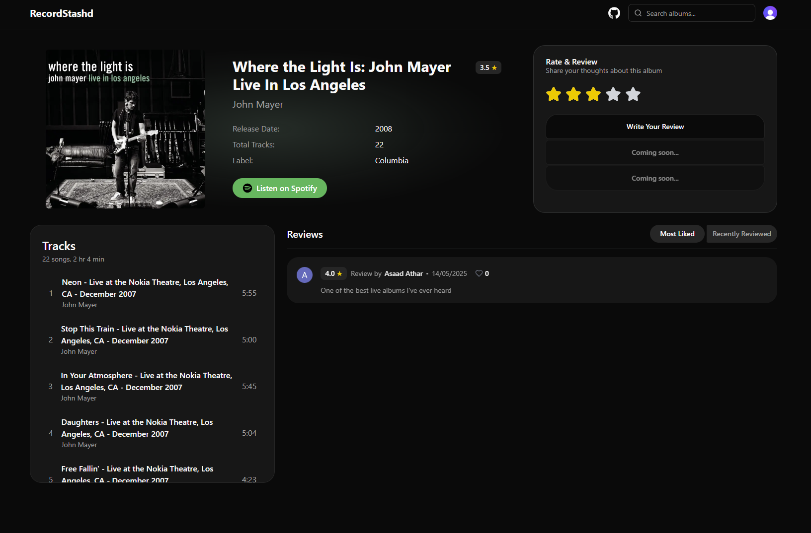
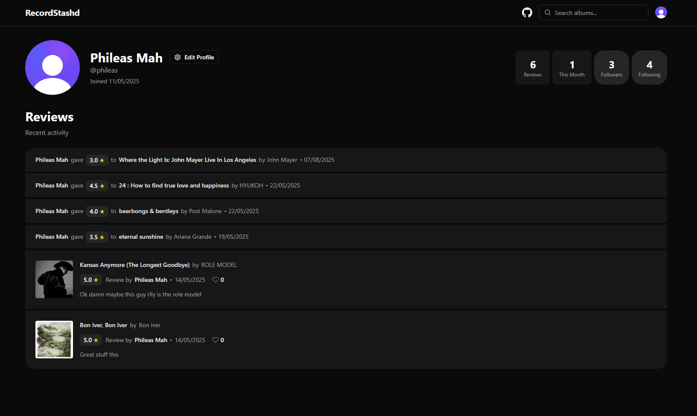

## Album Review App

A simple social album review app built with Next.js and Convex, with Spotify integration for album and artist data. Browse albums, write reviews, see what's popular, and follow other listeners.

## Screenshots
Home Page


Album Page


Profile Page


## Getting Started

First, run the development server:

```bash
npm run dev
# or
yarn dev
# or
pnpm dev
# or
bun dev
```
Convex server
```bash
npx convex dev
```

## Good to knows 
- Env values for Convex in `auth.config.ts` is configured in the Convex dashboard